# Graphical user interface for phase I `R` package `GUIP1`

  **D. Dinart(1), J. Fraisse(2), D. Tosi(2), A. Mauguen(3), Y. Laghzali(2), 
    C. Touraine(2), M.C. Le Deley(4), C. Bellera(1), C. Mollevi(2)**     
(1) Inserm CIC1401, Module Epidemiologie clinique, Institut Bergonie, Bordeaux, France     
(2) Institut du Cancer Montpellier (ICM), Montpellier, France     
(3) Memorial Sloan Kettering Cancer Center, New York, USA     
(4) Centre Oscar Lambret, Lille, France     

The first objective of `GUIP1` package is to simplify the use of model-based designs used in phase I trial. 

`GUIP1` package allows the user to: 

* **Test the operating characteristics of the underlying dose-toxicity model**
* **Manage in real-time a phase I trial**

## Package dependencies
To use GUIP1 package the following tools have to be installed:

* R packages: dfcrm, bcrm, tcltk, tcltk2, tkrplot, gridExtra, sp, stringr, openxlsx, magrittr, ggplot2, rjags, R2WinBUGS
* Just Another Gibbs Sampler [JAGS](https://sourceforge.net/projects/mcmc-jags/files/JAGS/) 

## Implemented designs

Currently, five model-guided adaptive (MGA) designs are implemented in `GUIP1` package:

* Continual Reassessment Method with Bayes estimate [CRMB](https://cran.r-project.org/package=dfcrm)
* Continual Reassessment Method with maximum likelihood estimate [CRML](https://cran.r-project.org/package=dfcrm)
* TIme-To-Event Continual Reassessment Method [TITE-CRM](https://cran.r-project.org/package=dfcrm))
* Escalation With Overdose Control [EWOC](https://cran.r-project.org/package=bcrm)
* TIme-To-Event Escalation With Overdose Control [TITE-EWOC](https://www.ncbi.nlm.nih.gov/pubmed/21351289)

## GUIP1 application
```{r eval=FALSE}
library(GUIP1)

### Launch GUIP1
GUIP1()
#select one of the 5 MGA designs
```

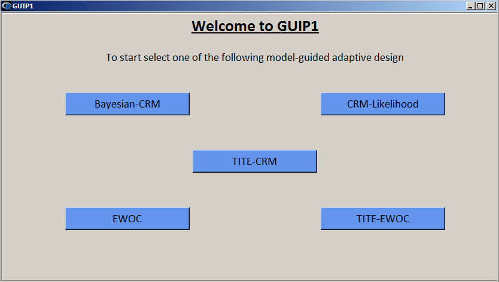

Once the model selected, the user is invited to choose between either the study of the operating characteristics 
of the underlying model via simulations or the management of a trial.

To do this, it's needed to click either on *interactive option* or *simulator option*. In the following, an example with 
CRMB design is provided.

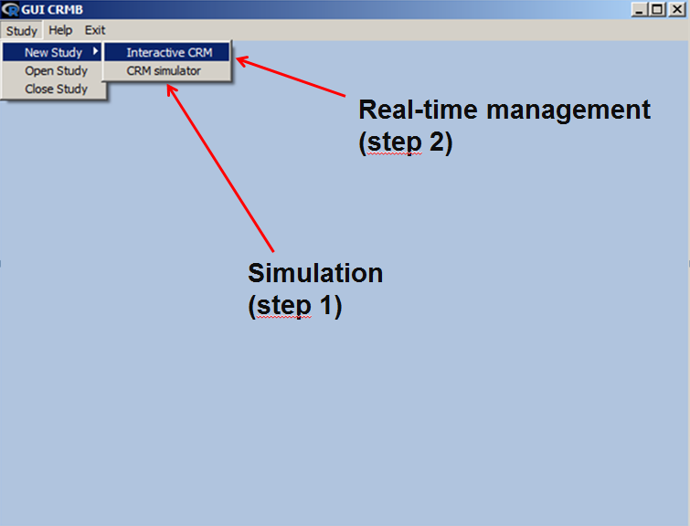

## Simulation
### Input parameters

To run simulations, all fields must be completed. The following input parameters are required:

* Number of dose levels
* Target DLT rate
* Sample size
* Number of simulations
* Starting dose level
* Seed
* Model: 
        
    * Logistic or Empiric for CRMB, CRML and TITE-CRM
    * Hyperbolic tangent, logistic, power or 2-parameter logistic for EWOC
    * Hyperbolic tangent, logistic, power for TITE-EWOC
* Parameters related to model if required
* Uncertainty prior distribution:

    * Only normal distribution with mean=0 is available for CRMB, CRML and TITE-CRM
    * Gamma, uniform, Lognormal and Bivariate Lognormal distributions are available for EWOC
    * Gamma and uniform distribtuions are available for TITE-EWOC
* Prior alpha value: First value of the uncertainty variable (if required)
* Dose skipping constraint: To apply restrictions on dose skipping level
* Observation window: Periode where DLT is evaluated (if applicable)
* Pointest: Parameter to controle overdose escalation (if applicable)
* Study name
* Probabilities of toxicity:
    * True: probabilities theoretically observed
    * Prior: Guess probabilies 
    
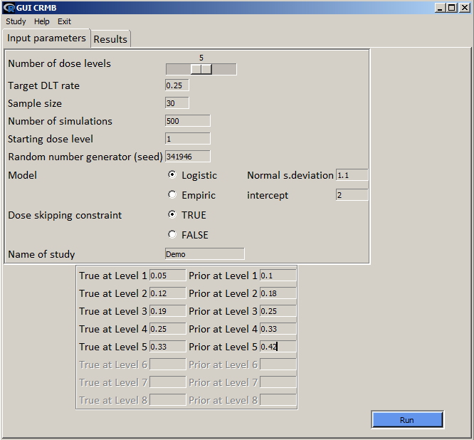


### Outputs
Once the simulations run, it's possible to visualize the output in the *Results* tab.

The user can retrieve:

* A summary of the entered inputs
* the MTD distribution (recommendation  percentage of each dose level as being the MTD)
* the average number of patients treated by dose level
* the average number of toxicities observed by dose level

All of these results can be either export in an excel file or being saved into R file.

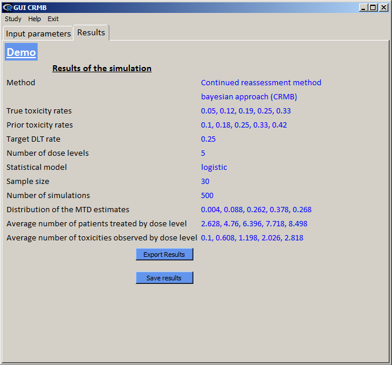


## Trial management
### Input parameters

Fig5. and Fig6. are dedicated to input parameters needed to manage a trial.
Overall, the same parameters than those presented in simulation section are required except those related to simulation (seed etc.).
Depending on the design chosen, all parameters required can be displayed on the same tab.
The following input parameters are required:

* Number of dose levels
* Target DLT rate
* Halfwidth parameter (if available): A help to define the interval between the prior probabilities
* Model: 
        
    * Logistic or Empiric for CRMB, CRML and TITE-CRM
    * Hyperbolic tangent, logistic, power or 2-parameter logistic for EWOC
    * Hyperbolic tangent, logistic, power for TITE-EWOC
* Parameters related to model if required
* Prior guess of MTD (dose level)
* Uncertainty prior distribution:

    * Only normal distribution with mean=0 is available for CRMB, CRML and TITE-CRM
    * Gamma, uniform, Lognormal and Bivariate Lognormal distributions are available for EWOC
    * Gamma and uniform distribtuions are available for TITE-EWOC
* Observation window: Periode where DLT is evaluated (if applicable)
* Pointest: Parameter to controle overdose escalation (if applicable)
* Dose skipping constraint: To apply restrictions on dose skipping level (if available)
* Stopping rules:
    * Maximun number of patients to be included in the trial
    * Maximum number of patient to be entered at a dose level (if available)
* Number of patients related to the stopping rules
* Study name
* Prior probabilities of toxicity (may be completed automatically with some designs but the user is free to change the estimates)


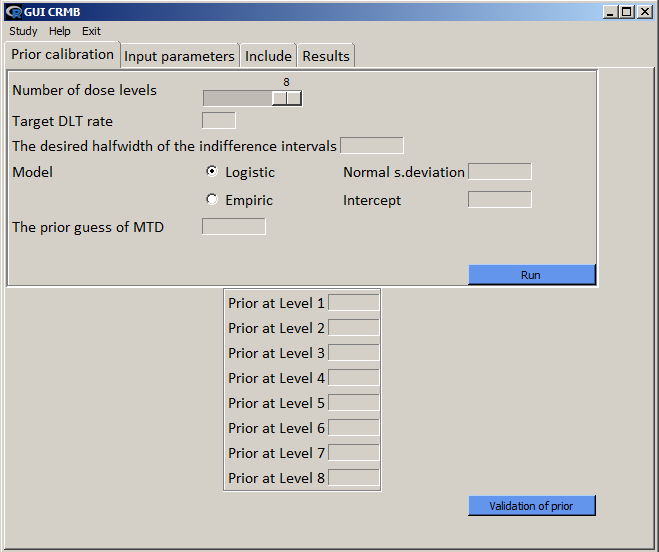

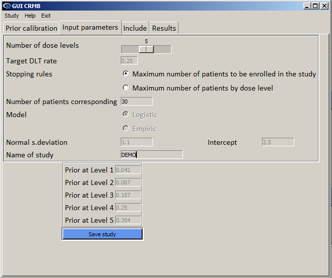

### How to include a patient

The *Include* tab contains a short summary of trial inputs and the current state of inclusions and recommendations.

The dose level recommended for the next patient corresponds to dose level displayed in **estimated MTD**. This is the dose level estimated as being closest to the targeted DLT rate.
From this tab, the user can either include a patient with **New patient** button or complete information for a  patient with **Pending patient** button or modify information already entered with **Modif data patient** button.
The last 2 buttons are not available for all designs. Basically, **Modif data patient** button is reserved for TIme-To-Event designs.


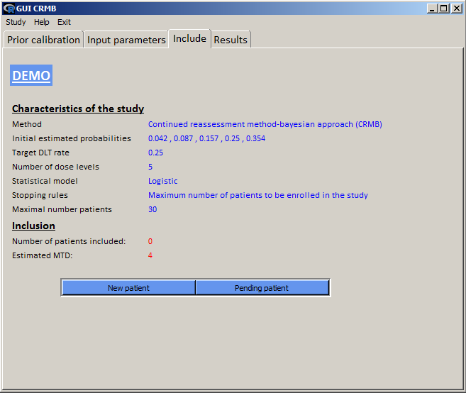

To include a patient it's needed to click on the **New patient** button displayed in  *Include* tab and entered information from previous patient.
The information required are:

* Dose level assigned
* Toxicity response (DLT y/n)
* Pending allows to include a patient even with a unknown toxicity response (if available)
* Follow-up time (if applicable)
* Delay time (if applicable)


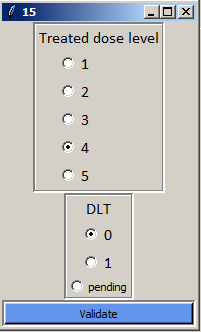

#### Pending patient or patient with evolving status

The two options **Pending patient** and **Modif data patient** work the same way. The user is invited to select the patient concerned and in the first case provide the toxicity response (Y/N). In the second case, the user can modify (update) all information provided about a patient. This option is particularly handy for TITE designs where patients entered in a staggered fashion.


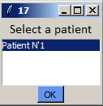


## Result outputs

*Results* tab is visible from the first inclusion. In this tab, the user will be able to visualize outputs at patient and dose level, as well as graphics describing dose-toxicity and patient-toxicity relastionship and export his results in excel and pdf files.


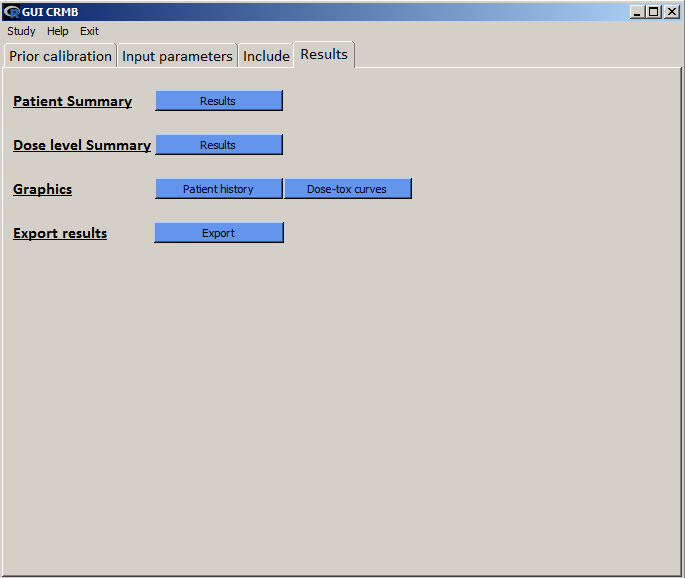

By clicking on *Patient summary results* a table summarizing the data entered for each patient:

* ID: order of arrival
* Presence of toxicity (y/n)
* Dose level assigned
* Follow-up time (if applicable)
* Delay time (if applicable)


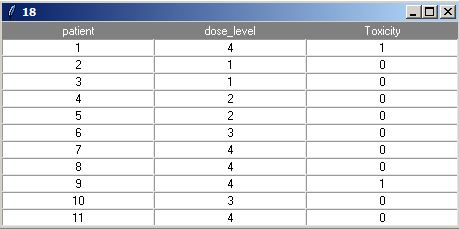

Depending on the selected design, the information provided by *Dose level summary results* are quite different, not all of the following information are displayed. The following is given for each dose level:

* Prior probabilities of toxicity
* Number of patient treated 
* Number of toxicities
* Posterior probabilities of toxicity
* Posterior mean probabilities of toxicity
* Posterior probability quantiles of toxicity
* Confidence interval of posterior probabilities of toxicity 


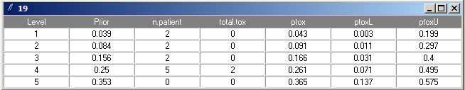

**Fig 13.** is a graphic describing the relationship between the patient number and the presence or not of toxicity. Presence of toxicity is represented by a red circle.


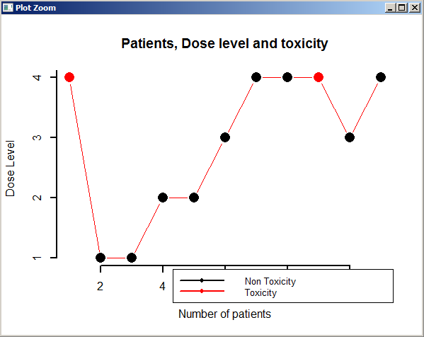


**Fig 14.**, **Fig 15.** and **Fig 16.** are graphics describing dose-toxiciy relationship either with the help of curves and confidence intervals or boxplots. The graphics proposed vary with the selected design. 


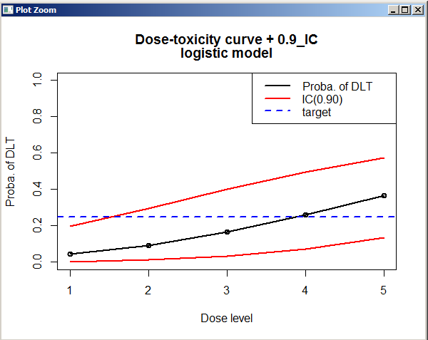


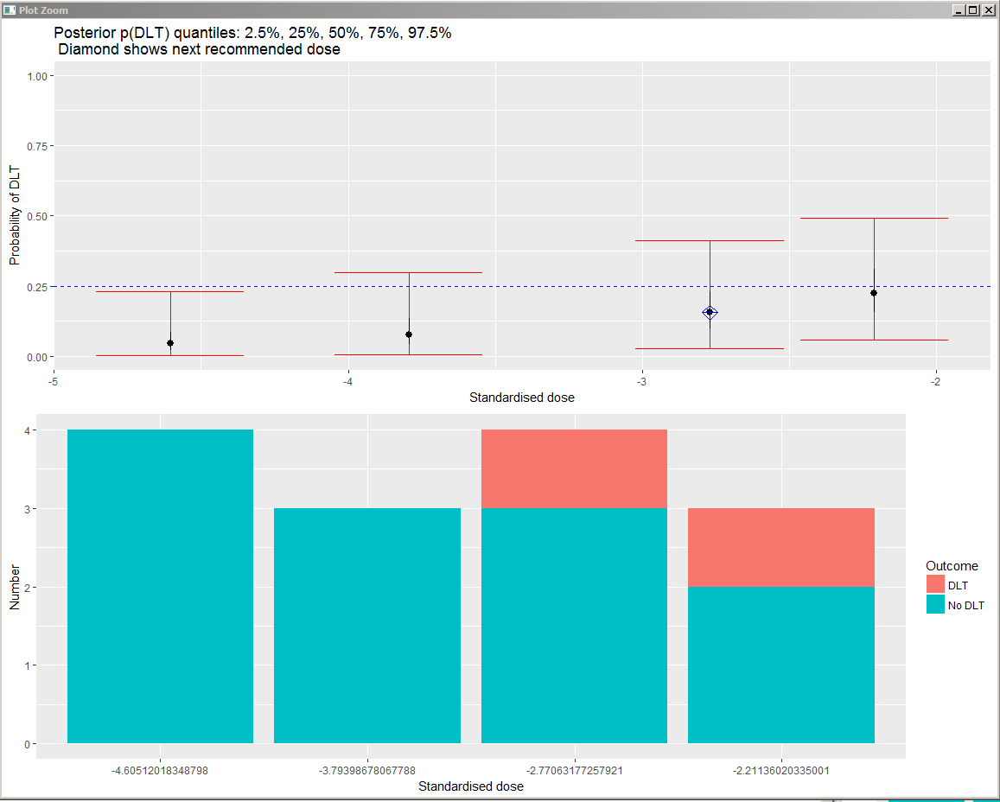

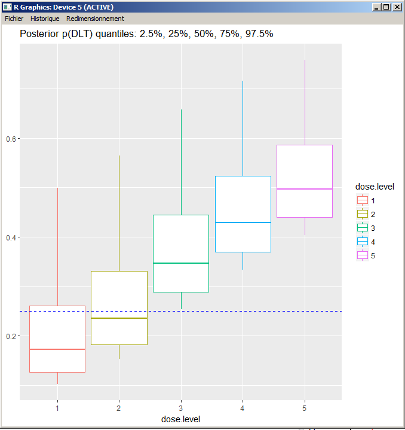


# references
O'Quigley, J., Pepe, M., and Fisher, L. (1990). Continual reassessment method: a practical design for phase 1 clinical trials in cancer. Biometrics 46, 33-48.

O'Quigley, J., and Shen, L.Z. (1996). Continual reassessment method: a likelihood approach. Biometrics 52, 673-684.

Babb, J., Rogatko, A., and Zacks, S. (1998). Cancer phase I clinical trials: efficient dose escalation with overdose control. Stat. Med. 17, 1103-1120.

Cheung, Y.K., and Chappell, R. (2000). Sequential designs for phase I clinical trials with late-onset toxicities. Biometrics 56, 1177-1182.

Mauguen, A., Le Deley, M.C., and Zohar, S. (2011). Dose-finding approach for dose escalation with overdose control considering incomplete observations. Stat. Med. 30, 1584-1594.
